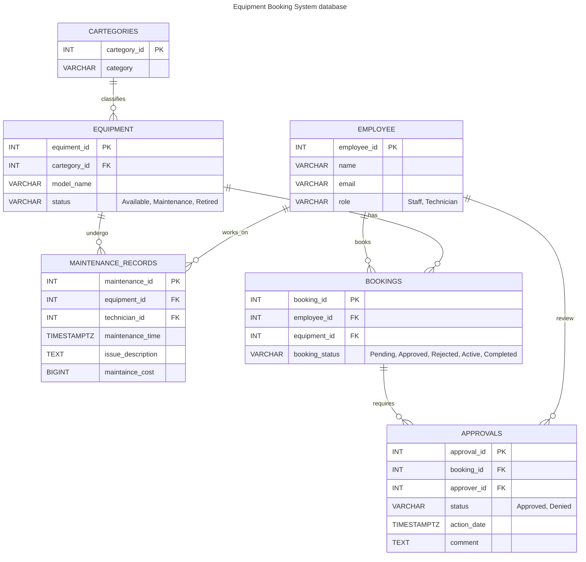

```mermaid
---
title: Equipment Booking System database
---

erDiagram
    EMPLOYEE{
        INT employee_id PK
        VARCHAR name
        VARCHAR email
        VARCHAR role "Staff, Technician"
    }

    CARTEGORIES{
        INT cartegory_id PK
        VARCHAR category
    }
    EQUIPMENT{
        INT equiment_id  PK
        INT cartegory_id FK
        VARCHAR model_name
        VARCHAR status "Available, Maintenance, Retired"
    }

    MAINTENANCE_RECORDS{
        INT maintenance_id PK
        INT equipment_id FK
        INT technician_id FK
        TIMESTAMPTZ maintenance_time
        TEXT  issue_description
        BIGINT maintaince_cost
    }


    APPROVALS{
        INT approval_id PK
        INT booking_id FK
        INT approver_id FK
        VARCHAR status "Approved, Denied"
        TIMESTAMPTZ action_date
        TEXT comment
    }

    BOOKINGS{
        INT booking_id PK
        INT employee_id FK
        INT equipment_id FK
        VARCHAR booking_status "Pending, Approved, Rejected, Active, Completed"
    }
    EMPLOYEE ||--o{BOOKINGS:"books"
    EQUIPMENT||--o{ BOOKINGS:"has"
    CARTEGORIES||--o{EQUIPMENT:"classifies"
    BOOKINGS||--O{APPROVALS:"requires"
    EMPLOYEE||--o{APPROVALS:"review"
    EQUIPMENT||--o{MAINTENANCE_RECORDS:"undergo"
    EMPLOYEE ||--o{MAINTENANCE_RECORDS:"works_on"
```
