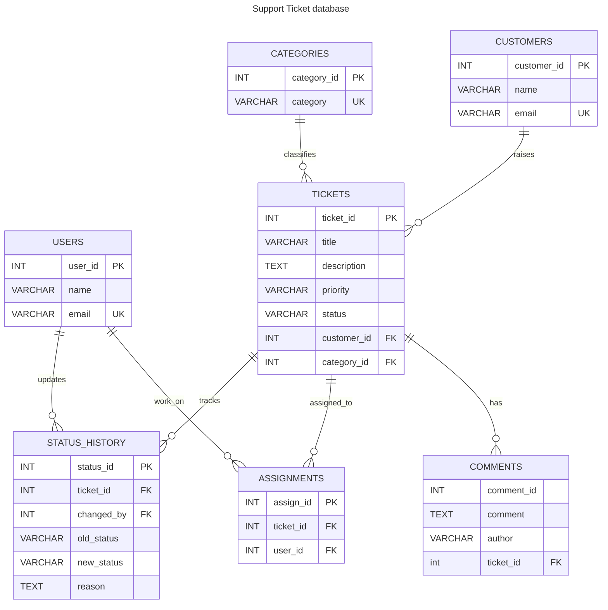

```mermaid
---
title: Support Ticket database
---

erDiagram
    USERS{
        INT user_id PK
        VARCHAR name
        VARCHAR email UK
    }

    CUSTOMERS{
        INT customer_id PK
        VARCHAR name
        VARCHAR email UK
    }

    CATEGORIES{
        INT category_id PK
        VARCHAR category UK
    }

    TICKETS{
        INT ticket_id PK
        VARCHAR title
        TEXT description
        VARCHAR priority
        VARCHAR status
        INT customer_id FK
        INT category_id FK
    }

    COMMENTS{
        INT comment_id
        TEXT comment
        VARCHAR author
        int ticket_id FK
    }

    ASSIGNMENTS{
        INT assign_id PK
        INT ticket_id FK
        INT user_id FK
    }


    STATUS_HISTORY{
        INT status_id PK
        INT ticket_id FK
        INT changed_by FK
        VARCHAR old_status
        VARCHAR new_status
        TEXT reason
    }

    CUSTOMERS|| --o{ TICKETS: "raises"
    CATEGORIES ||--o{TICKETS: "classifies"

    TICKETS||--o{ COMMENTS: "has"
    
    USERS||--o{ASSIGNMENTS: "work_on"
    TICKETS||--o{ASSIGNMENTS: "assigned_to"

    TICKETS||--o{STATUS_HISTORY: "tracks"
    USERS||--o{STATUS_HISTORY: "updates"

```
